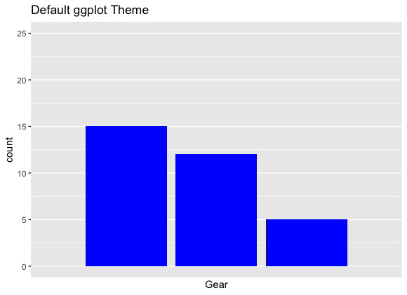
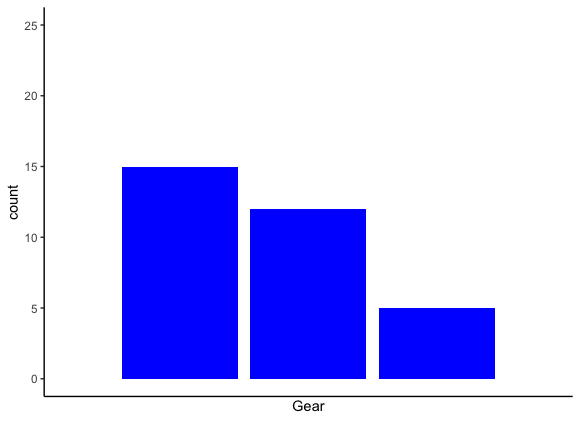
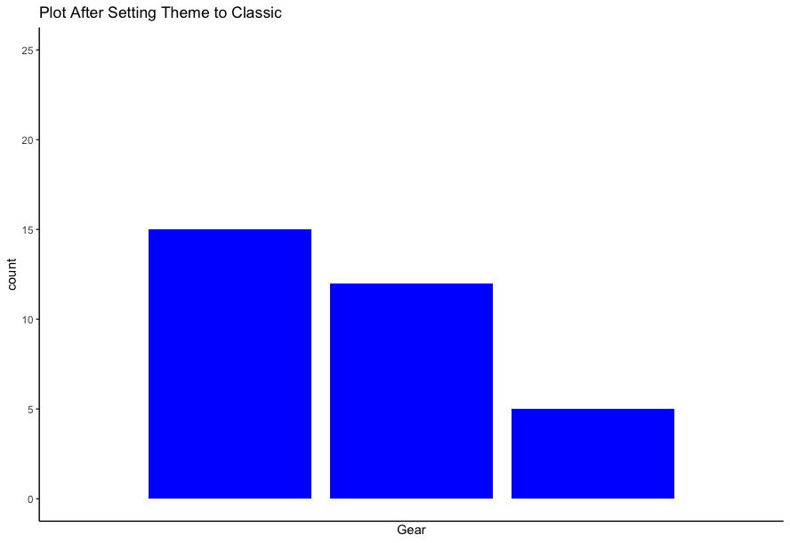
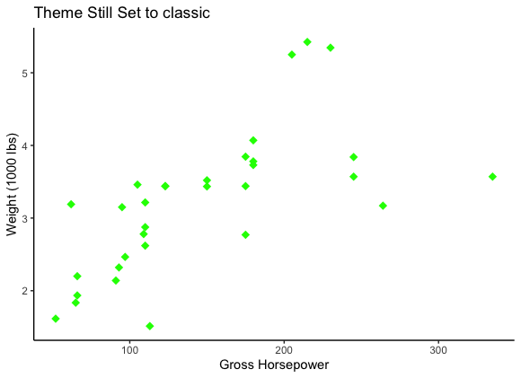
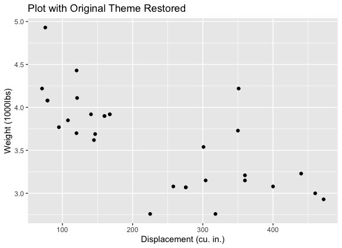

# Apply a ggplot() Theme to all plots in a Script or Notebook

> This recipe shows how to apply a theme to multiple plots in an R script or notebook.

Libraries required:
- `ggplot2`

Themes are used in `ggplot()` to control how plots look. They can also be used to create a consistent look to all plots.

We load the required library and grab some data to use to generate plots.
```R
library(ggplot2)
data <- mtcars
```
We'll start be creating a plot with the default theme.

```R
ggplot(mtcars, aes(x=gear)) +
  geom_bar(stat="count", fill="blue") +
  ylim(0, 25) +
  scale_x_discrete(name = 'Gear',
                     labels=c('3'='3 Gears', 
                              '4'='4 Gears', 
                              '5'='5 Gears')) +
  ggtitle("Default ggplot Theme")
```



One way to add a theme is to add it to a single plot. We add the "classic" theme to the following plot.

```R
ggplot(mtcars, aes(x=gear)) +
  geom_bar(stat="count", fill="blue") +
  ylim(0, 25) +
  scale_x_discrete(name = 'Gear',
                     labels=c('3'='3 Gears', 
                              '4'='4 Gears', 
                              '5'='5 Gears')) + 
  ggtitle("Plot using classic theme") +
  theme_classic()
```


However, this only adds the theme to this plot all following plots will go back to the default theme unless `+ theme_classic()` is added.

In order to apply themes across multiple plots, we can use the functions `theme_get()` and `theme_set()`. In the following code, we store the default theme, set a new theme to generate a couple of plots and then set the theme back to the default for a final plot.

```R
# Get the current theme (currently the default theme)
old_theme <- theme()

# Set theme to the classic theme
theme_set(theme_classic())

# Create a plot
ggplot(mtcars, aes(x=gear)) +
  geom_bar(stat="count", fill="blue") +
  ylim(0, 25) +
  scale_x_discrete(name = 'Gear',
                     labels=c('3'='3 Gears', 
                              '4'='4 Gears', 
                              '5'='5 Gears')) +
  ggtitle("Plot After Setting Theme to Classic")
```
We can confirm that the plot uses the classic theme. 



```R
# Create another (also has classic theme applied)

ggplot(data=data, mapping=aes(x=hp, y=wt)) +
  geom_point(shape=18, color='green', size=3) +
  xlab('Gross Horsepower') +
  ylab('Weight (1000 lbs)') +
  ggtitle("Theme Still Set to classic")
```
Look! We still get the classic theme, but we don't have to add `+ theme_classic()`!



We can then use our `old_theme` variable to restore the default theme.

```R
# Use old_theme() to set theme back to default
theme_set(old_theme)

# Generate final plot (has the default theme)
ggplot(data=data, aes(x=disp,y=drat)) + 
    geom_point() + 
    xlab('Displacement (cu. in.)') + 
    ylab('Weight (1000lbs)') +
    ggtitle("Plot with Original Theme Restored")
```



We are back to the default theme.