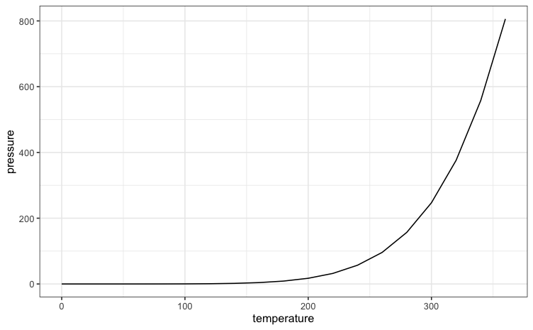
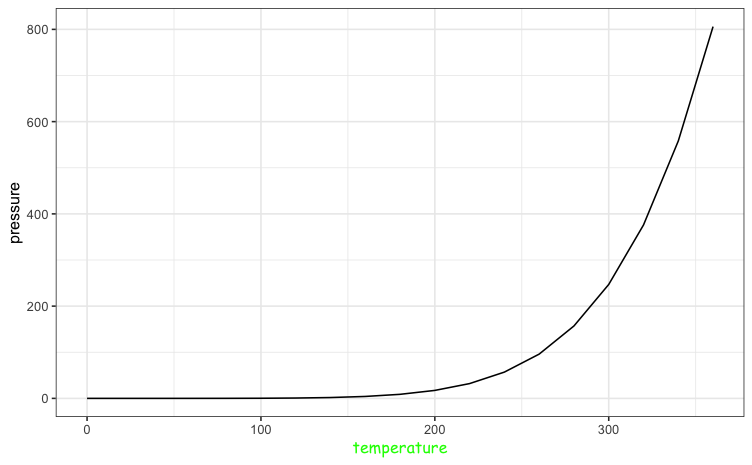
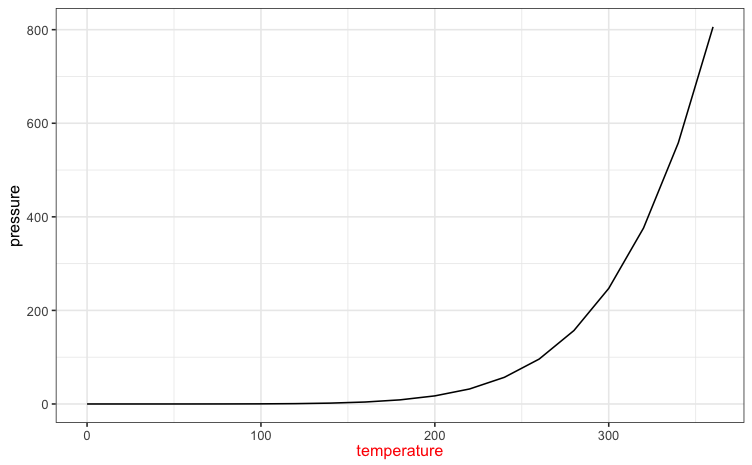

# Using `ggplot` Themes: theme_update() vs. theme_replace()

> This recipe shows the difference between ggplot's theme_replace() and theme_update() methods.

Libraries required:
- `ggplot2`

Themes provided in ggplot() can be used to give plots a consistent look and feel. While users are able to make a theme from scratch, it is frequently easier to take an existing theme and make modifications. 

Two ggplot() methods can be used to modify an existing theme: theme_update() or theme_replace(). These methods allow you to change components associated with a plot generated in ggplot(). These components include items like the axis titles (used in this example), grid lines, plot titles, etc. A full list of ggplot components can be found [here](https://ggplot2.tidyverse.org/reference/theme.html). 

The methods work very similarly, but have a subtle difference that means they shouldn't be used interchangeably. Let's see the difference in action.

First, we'll generate a plot using the pressure data available in R. We'll choose one of ggplot's themes and look the plot.

```R
# load library
library(ggplot2)

# load some data
data(pressure)

# Make a plot we can play with
p <- ggplot(data=pressure, aes(x=temperature, y=pressure)) + geom_line()

# Set our theme to theme_bw()
theme_set(theme_bw())

# Look at plot
p
```


Pay attention to the x-axis title this is the component we will change in our theme. We can access the component's settings by using theme_get() and the component we are interested in.

```R
# show settings in the axis.title.x element
theme_get()$axis.title.x
```
```
List of 11
 $ family       : NULL
 $ face         : NULL
 $ colour       : NULL
 $ size         : NULL
 $ hjust        : NULL
 $ vjust        : num 1
 $ angle        : NULL
 $ lineheight   : NULL
 $ margin       : 'margin' num [1:4] 2.75points 0points 0points 0points
  ..- attr(*, "unit")= int 8
 $ debug        : NULL
 $ inherit.blank: logi TRUE
 - attr(*, "class")= chr [1:2] "element_text" "element"
 ```

There are 11 settings available for this component. we see that currently `vjust`, `margin` and `inherit.blank` have been set. Let's start by using theme_update(). We'll change the font and it's color. Then see the changes visually in the plot and look at what changed in the component settings.

```R
# Change the title font & color
theme_update(axis.title.x = element_text(family='Comic Sans MS',
                                         colour="green"))
# Show the plot
p
# Look at the settings for the component
theme_get()$axis.title.x
```
Plot:



Changes to component:

```
List of 11
 $ family       : chr "Comic Sans MS"
 $ face         : NULL
 $ colour       : chr "green"
 $ size         : NULL
 $ hjust        : NULL
 $ vjust        : num 1
 $ angle        : NULL
 $ lineheight   : NULL
 $ margin       : 'margin' num [1:4] 2.75points 0points 0points 0points
  ..- attr(*, "unit")= int 8
 $ debug        : NULL
 $ inherit.blank: logi FALSE
 - attr(*, "class")= chr [1:2] "element_text" "element"
```

We see that now `family` and `colour` are set and `vjust`, `margin` and `inherit.blank` haven't changed. What happens if we use `theme_replace()`? Let's make the font color red and look at the plot.

```R
# Change the color of the title
theme_replace(axis.title.x = element_text(colour="red"))
# Show the plot
p

```
Plot:



Notice how the font for the title is no longer "Comic Sans MS". Let's look at the component settings to see why.

 ```R
 # Look at the settings for the component
theme_get()$axis.title.x
```

Changes to component:

```
List of 11
 $ family       : NULL
 $ face         : NULL
 $ colour       : chr "red"
 $ size         : NULL
 $ hjust        : NULL
 $ vjust        : NULL
 $ angle        : NULL
 $ lineheight   : NULL
 $ margin       : NULL
 $ debug        : NULL
 $ inherit.blank: logi FALSE
 - attr(*, "class")= chr [1:2] "element_text" "element"
```
In this case all the settings have been replaced with NULL **except** `colour`. This highlights the difference between `theme_update()` and `theme_replace()`. The first method changes only the settings requested and leaves all others "as is". The second method, however, changes all settings of a theme that are not changed to `NULL`. 

The recommendation is to use `theme_replace()` only when you want to change a setting and revert all others to `NULL`. In general, it is probably better to use `theme_update()`. 