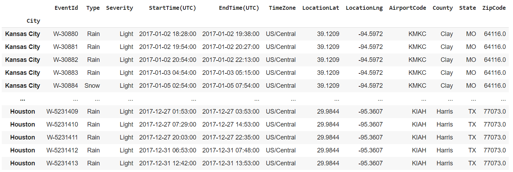

# Filtering data in a Pandas DataFrame based on Time-stamps

> This recipe shows how to filter data in a `pandas` `DataFrame` based on time-stamps.

Problem Objective: There are two files, flightData.csv and wetherData.csv that contains the departure time of flights and the start and end times of weather events respectively. Our objective is to filter out the details of flights that operated during the weather events mentioned in the weatherData.csv.

Libraries required:

- `pandas`

In the code chunk below, we'll import `pandas`, and read two `csv` files as  `pandas` `DataFrame`.

```python
import pandas as pd
# Load the csv file flightData.csv as a Pandas Dataframe. The argument index_col="municipality" is used to make the column "municipality" as the row labels of the DataFrame
flightData = pd.read_csv("folder_location/flightData.csv", index_col="municipality")

# Load the csv file weatherData.csv as a Pandas Dataframe
weatherData = pd.read_csv("folder_location/weatherData.csv", index_col="City")
```

The following code snippets show the contents of the **flightData** `DataFrame`.

```python
print(flightData)
```


The following code snippets show the contents of the **weatherData** `DataFrame`.

```python
print(weatherData)
```




In the chunk below, we'll rename the *municipality* field in **flightData** to *City* so that both **flightData** as well as **weatherData** have a common field called *City*. 

```python 
# Renaming the "municipality" field to "City".
flightData.index.names =["City"] 
```

Converting the fields that contain time data to `datetime` datatype.

```python 
flightData["DATE_TIME"] = flightData["DATE_TIME"].apply(pd.to_datetime)
weatherData["StartTime(UTC)"] = weatherData["StartTime(UTC)"].apply(pd.to_datetime)
weatherData["EndTime(UTC)"] = weatherData["EndTime(UTC)"].apply(pd.to_datetime)
```

Merging the two dataframes based on the *City* field.

```python 
joinedData = pd.merge(flightData, weatherData, on="City")
```

The following lines of code filters out the details of the flights that took off during the weather events mentioned in the weatherData.csv.

```python 
finalData = joinedData[(joinedData["DATE_TIME"] >= joinedData["StartTime(UTC)"]) & (joinedData["DATE_TIME"] <= joinedData["EndTime(UTC)"])]
print(finalData)
```

